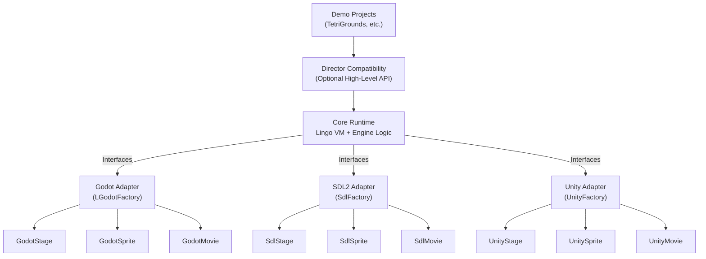
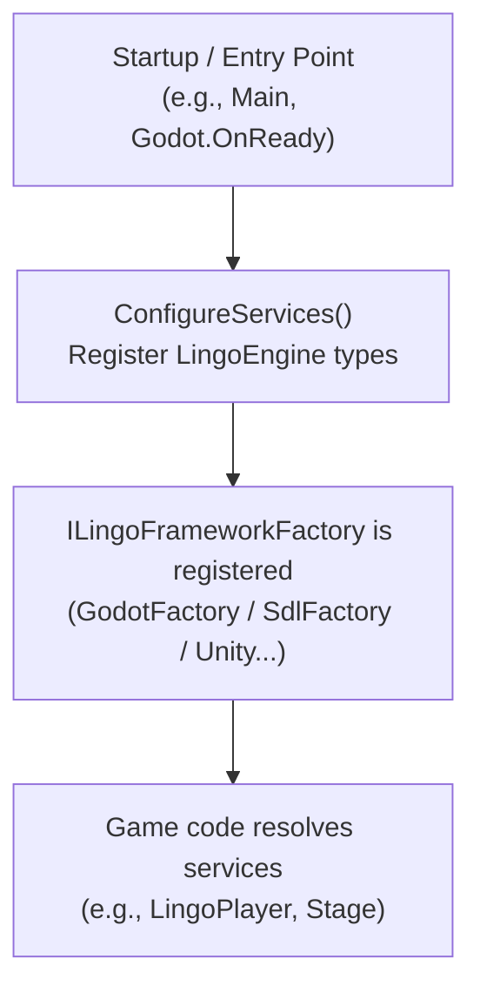
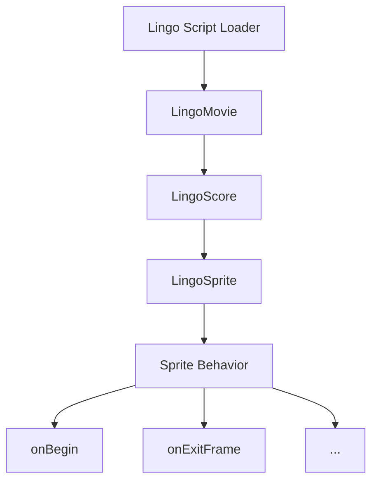
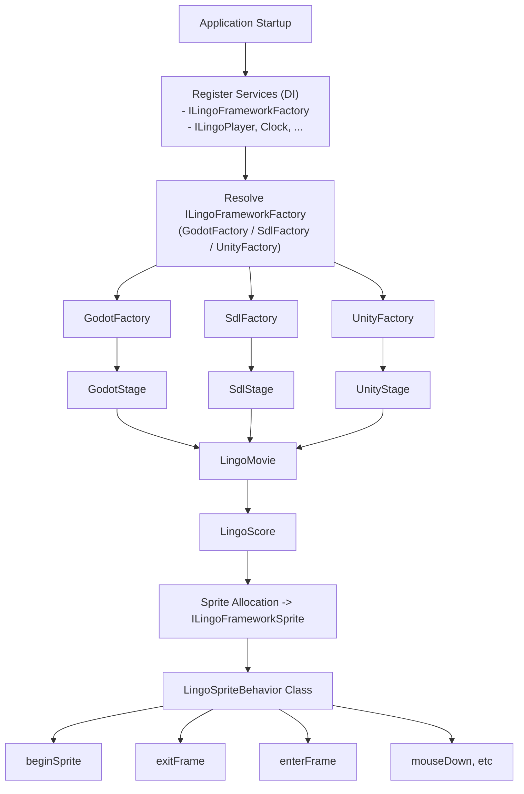

# 🏗️ LingoEngine Architecture Overview

LingoEngine is built as a **layered, modular system** that emulates the core behaviors of Macromedia Director using a modern C# runtime. Its architecture is designed to isolate core logic from platform-specific details — allowing you to reuse scripts and game logic across multiple rendering backends such as **Godot** and **SDL2**.

---

## 📐 Architecture Layers

LingoEngine is organized into four main architectural layers:
| Layer               | Description |
|---------------------|----------------------------------------------------------------------------------------------------------------------------------|
| **Core**            | The Lingo language runtime and virtual machine (VM) — fully rendering-agnostic. |
| **Framework Adapters** | Abstractions that allow the engine to run on multiple rendering platforms (Godot, SDL2, etc.). |
| **Director Layer**  | Optional high-level APIs that mimic Macromedia Director's original movie/cast/score model. |
| **Demo Projects**   | Sample integrations demonstrating how to use LingoEngine with real frameworks and games. |
Each adapter implements a well-defined set of interfaces to ensure the **core engine remains untouched** regardless of the target platform.

---

## 🔌 Interfaces & Implementations

At the heart of the engine is the `src/LingoEngine` project. It defines the key **engine interfaces** that abstract away rendering and platform specifics:

- `ILingoFrameworkStage` – represents the rendering surface
- `ILingoFrameworkSprite` – represents visual sprite elements
- `ILingoFrameworkMovie` – encapsulates timeline logic and score interaction
- `ILingoFrameworkGfxNodeInput`, `ILingoFrameworkMouse`, etc. – abstract input handling
- `ILingoFrameworkFactory` – used to construct platform-native instances of all of the above

### Example: Framework Agnostic Usage

The core engine depends only on these interfaces:

```csharp
ILingoFrameworkFactory factory = new GodotFactory(serviceProvider, root);
var stage = factory.CreateStage(new LingoPlayer());
var movie = factory.AddMovie(stage, new LingoMovie("Demo"));
```

This allows your game logic, Lingo scripts, and runtime behaviors to work **without ever knowing** if it's rendering with Godot or SDL2.

---

## 🏭 Factory Pattern

LingoEngine uses the **Factory pattern** to inject framework-specific implementations.

- Each rendering adapter (e.g., Godot or SDL2) defines its own `ILingoFrameworkFactory` implementation.
- These factories are usually registered in a **DI container** (e.g., `Microsoft.Extensions.DependencyInjection`).
- When the engine starts, it queries the factory to obtain the correct platform-native objects.

### Benefits:
- ✅ Decouples game logic from rendering details
- ✅ Allows easy addition of new adapters
- ✅ Encourages testability and interface-driven design

---

## 🧪 Adapter Implementations

Each adapter project (e.g., `LingoEngine.LGodot` or `LingoEngine.SDL2`) provides concrete implementations for the core interfaces:

| Adapter              | Provided Classes |
|----------------------|--------------------------------------------------------------|
| `LingoEngine.LGodot` | `GodotStage`, `GodotSprite`, `GodotMovie`, `GodotFactory`    |
| `LingoEngine.SDL2`   | `SdlStage`, `SdlSprite`, `SdlMovie`, `SdlFactory`            |
These map to native objects in the respective frameworks while still adhering to the engine contracts.

---

## 🎬 Optional Director Layer

The `src/Director` folder contains a **higher-level API surface** that mirrors Macromedia Director's built-in behaviors more closely:

- `LingoEngine.Director.Movie` – manages movie playback and score state
- `LingoEngine.Director.Cast` – emulates cast member access
- `LingoEngine.Director.Stage` – provides legacy stage behaviors
- `LingoEngine.Director.Key/Sound/System/...` – optional subsystems mimicking Director APIs

This layer is **optional** but useful for full-featured game recreation.

---

## 🧪 Demo Projects

Demo implementations such as `Demo/TetriGrounds` showcase how to wire everything together:

- Uses `ServiceCollection` to register components
- Boots the game through the correct adapter (`WithLingoSdlEngine()` or `WithLingoGodotEngine()`)
- Demonstrates script-driven gameplay using real Lingo behaviors

---

## 📌 Summary

LingoEngine's architecture enables:

- 🔁 **Script portability** between rendering platforms
- 🔍 **Code clarity and separation of concerns**
- 🧱 **Scalable engine growth** through pluggable components
- 🕹️ **Faithful Director emulation** with optional compatibility layers

---


## 🧭 Architecture Diagram



### IOC Architecture Layers


This diagram illustrates how script handlers like onBeginSprite, onExitFrame, etc., are connected to the core VM logic and dispatched into sprite behaviors.



### A flow schema:

### Summary
- From application startup, services and adapters are registered into a DI container.
- The core engine then resolves platform-specific types via ILingoFrameworkFactory.
- LingoMovie and LingoScore manage the timeline and sprite orchestration.
- Sprite behaviors respond to dispatched events such as enterFrame, exitFrame, mouseDown, etc.


## 📎 See Also

- [README.md](../README.md)
- [Godot Setup Guide](GodotSetup.md)
- [SDL2 Setup Guide](SDLSetup.md)
- [Lingo vs C# Differences](../Lingo_vs_CSharp.md)

---

Let me know if you'd like a visual diagram added next!
